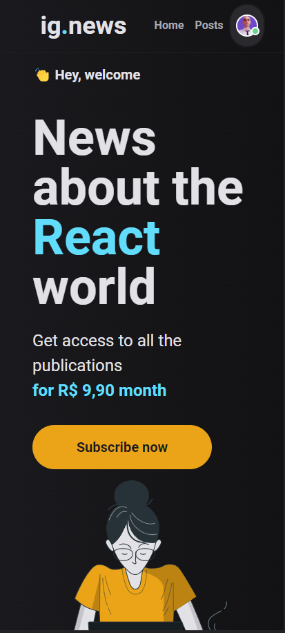

<div align="center">
     
     
</div>
    
<p align="center">   
    
</p>
<p align="center">
  <a href="#sobre">Sobre</a>&nbsp;&nbsp;&nbsp;|&nbsp;&nbsp;&nbsp;
  <a href="#tecnologias">Tecnologias</a>&nbsp;&nbsp;&nbsp;|&nbsp;&nbsp;&nbsp;
  <a href="#como-executar">Como Executar</a>&nbsp;&nbsp;&nbsp;|&nbsp;&nbsp;&nbsp; 
</p>

## Sobre

O projeto tem como objetivo o estudo e desenvolvimento de uma aplicação em ReactJS com NextJS para listagem de posts e sistema de inscrição(subscription).

A aplicação foi desenvolvida utilizando o framework NextJS aplicando conceitos como consumo de API externas, API Root, Server Side Rendering (SSR), Static Site Generation (SSG), STRIPE para pagamentos das subscriptions, NextAuth para autenticação com Github, FaunaDB para armazenar as informações do usuário em um banco de dados e Prismic CMS para adição e gerenciamento do conteúdo dos posts.

## Tecnologias

- [Typescript](https://www.typescriptlang.org/)
- [NextJS](https://nextjs.org/)
- [Next-Auth](https://next-auth.js.org/)
- [Chakra-ui](https://chakra-ui.com/)
- [axios](https://github.com/axios/axios)
- [Stripe](https://stripe.com/br)
- [FaunaDB](https://www.fauna.com/fauna)
- [Prismic](https://www.prismic.io/)

## Como Executar

- ### **Pré-requisitos**

  - É **necessário** possuir o **[Node.js](https://nodejs.org/en/)** instalado no computador
  - É **necessário** possuir o **[Git](https://git-scm.com/)** instalado e configurado no computador
  - Também, é **preciso** ter um gerenciador de pacotes seja o **[NPM](https://www.npmjs.com/)** ou **[Yarn](https://yarnpkg.com/)**.
  - Por fim, é **essencial** ter o **[Expo](https://expo.io/)** instalado de forma global na máquina

  Criar conta e configurar os serviços externos:

- [Stripe](https://stripe.com/)
- [FaunaDB](https://fauna.com/)
- [Prismic CMS](https://prismic.io/)

1. Faça um clone do repositório:

```sh
  $ git remote add origin git@github.com:aleksanderpalamar/ignews.git
```

2. Executando a Aplicação:

```sh
  # Aplicação web
  $ cd ignews
  # Instalando as dependências do projeto.
  $ yarn # ou npm install
  # Inicie a aplicação web
  $ yarn start # ou npm start
```
3. Crie um arquivo `.env.local` com as configurações necessárias para a aplicação funcionar.

```sh
# Stripe
STRIPE_API_KEY=
NEXT_PUBLIC_STRIPE_PUBLIC_KEY=
STRIPE_WEBHOOK_SECRET=
STRIPE_SUCCESS_URL=http://localhost:3000/posts
STRIPE_CANCEL_URL=http://localhost:3000/

# GitHub
GITHUB_ID=
GITHUB_SECRET=

# FaunaDB
FAUNADB_KEY=

# Prismic CMS
PRISMIC_ENDPOINT=
PRISMIC_ACCESS_TOKEN=

#JWT
JWT_SECRET=

#Vercel
NEXTAUTH_URL=http://localhost:3000/
```

---
<sup>Projeto desenvolvido por [Aleksander Palamar](https://github.com/aleksanderpalamar), da [Blog](https://app.linuxupdate.com.br).</sup>